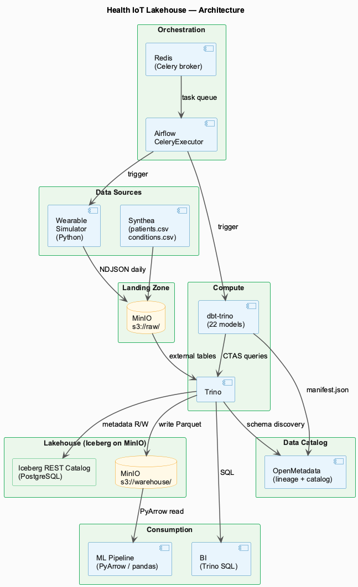
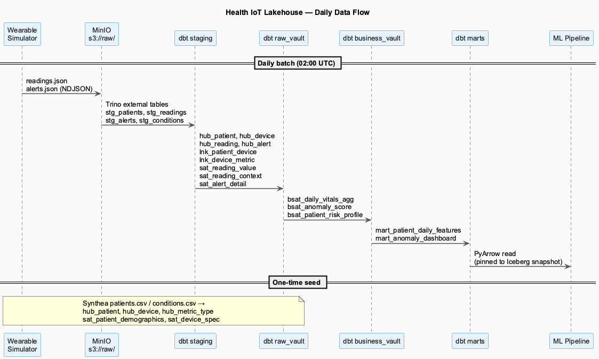
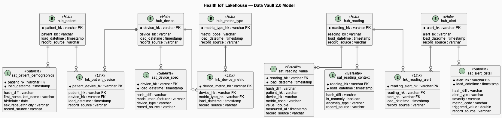

# health-iot-lakehouse

Lakehouse-платформа для данных носимых устройств здоровья с предсказанием аномалий за 24 часа.

Показатели жизнедеятельности (пульс, SpO2, шаги, температура кожи, глюкоза) проходят путь от сырых файлов до ML-готовых признаков через модель Data Vault 2.0 на Apache Iceberg. Полный стек запускается локально через Docker Compose.

---

## Стек

| Слой | Технология |
|------|-----------|
| Объектное хранилище | **MinIO** (S3-совместимое) |
| Формат таблиц | **Apache Iceberg** + REST Catalog (PostgreSQL backend) |
| Вычислительный движок | **Trino** |
| Трансформации | **dbt-trino** |
| Оркестрация | **Apache Airflow** (CeleryExecutor) + Redis |
| Каталог данных | **OpenMetadata** |
| Генерация данных | **Synthea** + кастомный Python-симулятор |

---

## Архитектура



---

## Структура репозитория

```
health-iot-lakehouse/
├── docker-compose.yml                # Основной стек
├── docker-compose.openmetadata.yml   # Стек OpenMetadata
├── .env.example                      # Шаблон переменных окружения
├── docs/
│   ├── ARCHITECTURE.md               # Описание компонентов и поток данных (EN)
│   ├── ARCHITECTURE_RU.md            # Описание компонентов и поток данных (RU)
│   ├── DATA_VAULT_MODEL.md           # Справочник Data Vault 2.0 (EN)
│   └── DATA_VAULT_MODEL_RU.md        # Справочник Data Vault 2.0 (RU)
├── simulator/                        # Python-симулятор носимых устройств
├── synthea/output/csv/               # Предгенерированные синтетические пациенты (10)
├── airflow/dags/                     # daily_ingest, dbt_raw_vault, dbt_business_vault
├── dbt_project/models/               # 22 модели: staging → raw_vault → business_vault → marts
├── openmetadata/ingestion/           # Конфиги ingestion для Trino и dbt
├── notebooks/                        # Исследование признаков, прототип ML
├── scripts/                          # Скрипты инициализации стека
└── trino/                            # Конфигурация Trino + Iceberg connector
```

---

## ML-кейс

**Цель:** предсказать аномальные события (аритмия, гипоксемия, гипо/гипергликемия) за 24 часа на основе паттернов данных носимых устройств.

**Признаки** из `mart_patient_daily_features`:
- Демография пациента: возраст, пол, ИМТ, хронические заболевания
- Дневные показатели: mean/std/min/max для HR, SpO2, шагов, температуры кожи, глюкозы
- Временные паттерны: 7-дневные скользящие средние, дневные дельты
- Профиль риска: уровень риска, аномальные события за последние 30 дней

**Целевая переменная:** бинарная метка `anomaly_next_24h`

**Воспроизводимость:** снимки Iceberg фиксируют обучающий датасет к конкретной версии данных.

---

## Ежедневный поток данных



---

## Быстрый старт

**Требования:** Docker Desktop (≥ 8 ГБ RAM), Python 3.11+

```bash
# 1. Запуск основного стека
cp .env.example .env
# Заполнить пароли в .env, затем:
docker compose up -d

# 2. Инициализация схем и начальных данных
bash scripts/seed_data.sh

# 3. Генерация данных симулятора
pip install -r simulator/requirements.txt
python -m simulator.cli generate-day --date 2026-03-25

# 4. Запуск dbt-моделей
cd dbt_project
TRINO_PORT=8090 dbt deps && dbt run && dbt test

# 5. Запуск OpenMetadata (опционально, требует доп. RAM)
docker compose -f docker-compose.openmetadata.yml up -d
```

---

## Эндпоинты сервисов

| Сервис | URL | Учётные данные |
|--------|-----|----------------|
| **OpenMetadata** | http://localhost:8585 | admin@openmetadata.org / admin |
| **Airflow** | http://localhost:8082 | admin / admin |
| **Trino UI** | http://localhost:8090 | admin (без пароля) |
| **MinIO Console** | http://localhost:9011 | из .env |
| Iceberg REST | http://localhost:8181 | — |
| PostgreSQL | localhost:5433 | из .env |

---

## Модель Data Vault



---

## Качество данных

- dbt-тесты: проверки диапазонов (HR 30–250, SpO2 70–100%), not-null, unique, ссылочная целостность — 206 тестов проходят
- Мониторинг свежести: устройства, молчащие более 24 часов, помечаются как устаревшие
- Колонки аудита в каждой строке спутника: `load_datetime`, `record_source`, `hash_diff`
- Полный граф линейности в OpenMetadata: источник CSV → staging → raw vault → marts

---

## Документация

- [Architecture / Архитектура (EN)](docs/ARCHITECTURE.md)
- [Архитектура (RU)](docs/ARCHITECTURE_RU.md)
- [Data Vault Model (EN)](docs/DATA_VAULT_MODEL.md)
- [Модель Data Vault (RU)](docs/DATA_VAULT_MODEL_RU.md)

---

## Лицензия

MIT
